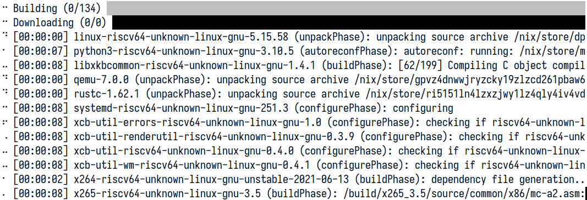
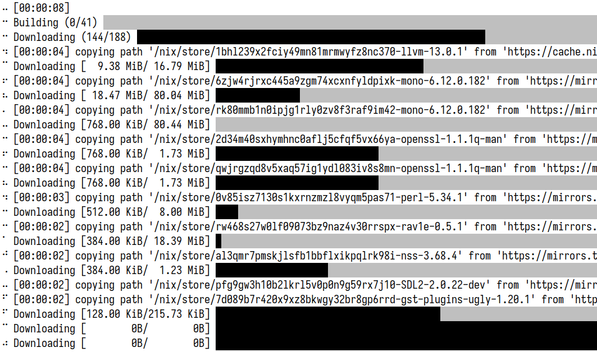

# nix-json-progress

Progress bars for Nix, using the `internal-json` log format.

Just a prototype for now. Problems include but are not limited to weird rendering issues, unimplemented features and incorrect ordering.

## Usage

```
$ nix build --log-format internal-json {args} |& nix-json-progress
```

## Screenshots

- Building several jobs

  

- Downloading paths from binary caches

  
